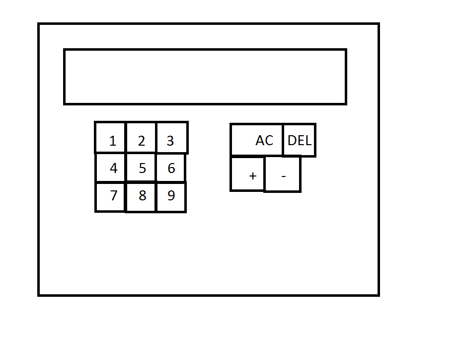
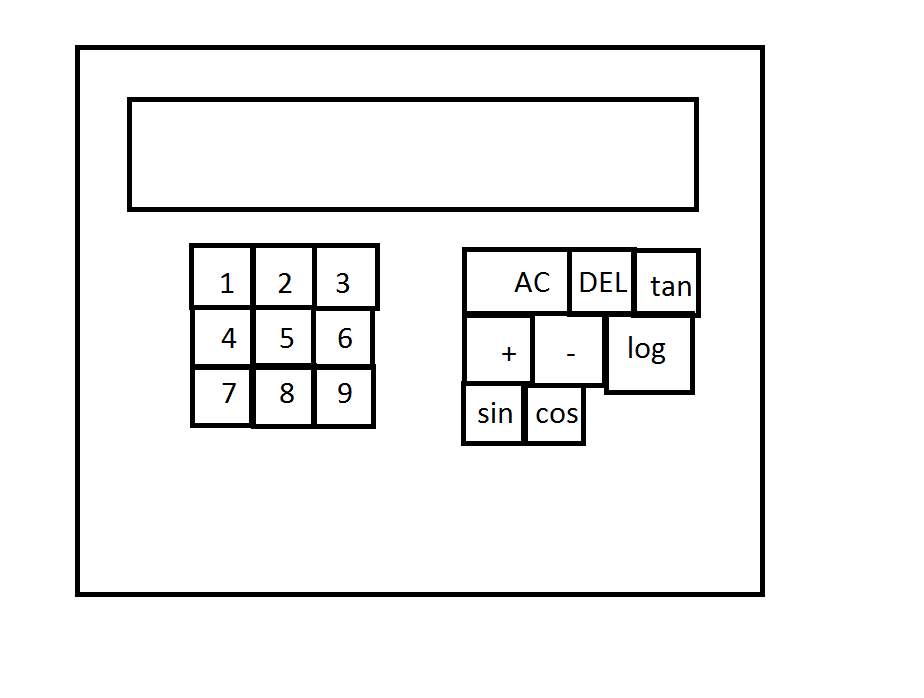

# Требования к проекту Calculator

# <h1>1 Введениe</h1>

 Приложение калькулятор – электронная версия вычислительного устройства для выполнения операций над числами или алгебраическими формулами.

Программа состоит из:
<ol> 
<li>
Basic view. Данное окно создается сразу после запуска приложения, простой вид калькулятора.
</li>
<li>
Scientific view. Данное окно создаётся сразу после выбора соответствующего пункта основного. Данный режим инженерного калькулятора позволяет выполнять большое количество тригонометрических функций.
</li>
</ol>

# <h1>2 Требования пользователя </h1>
<h2>2.1 Программные интерфейсы </h2>

Пользовательский интерфейс создан с помощью Swing окон: JFrame, JLabel, JPanel.

<ol>

<h2> 2.2 Интерфейс пользователя</h2>

В данном приложении пользователь будет взаимодействовать с приложением только при помощи мышки компьютера. После запуска приложения пользователь окажется в простом режиме калькулятора и сможет выполнять арифметические операции(рис. 1).

Рисунок 1 - Меню дефолтного калькулятора

Более сложный тип калькуляторов, разработанный для различных по сложности инженерных и научных расчетов. Такие калькуляторы способны делать расчеты с приоритетами операций и скобками, иногда позволяют делать расчеты с дробями, делают вычисления элементарных функций, а также поддерживают множество других расчетов (статистические, тригонометрические и пр.).(рис. 2).
 

Рисунок 2 - Меню инженерного калькулятора

 
<h2> 2.3 Характеристики пользователей</h2>

Данное приложение рассчитано на пользователей как минимум начального и среднего уровня образования и с минимальным уровнем владения ПК. Стоит отметить, что оно требует наличие минимальных знаний арифметики и алгебры, но при этом интуитивно понятно.

<h2> 2.4 Предположения и зависимости</h2>

Так как приложение компьютерное и не требует интернет соединения, то ограничений в использовании данного приложения нету.

# <h1>3 Системные требования</h1>
<h2> 3.1 Функциональные требования</h2>
<ol>
<li>
Качественное оформление приложения, включающее в себя понятный пользовательский интерфейс и подходящая цветовая гамма;
</li>
<li>
Наличие возможности проводить вычисления оффлайн;
</li>
<li>
Адекватная реакция приложения на различные ненормальные ситуации;
</li>
</ol>
<h2> 3.2 Нефункциональные требования</h2>

Приложение будет располагаться локально и соответственно, не требует повышенной степени безопасности. Для целостности работы приложения необходима защита данных приложения от несанкционированных действий, т.к. удаление какого либо файла из папки приложения приведет к критическим ошибкам приложения. Приложение будет работать только на ПК с операционной системой Windows.

